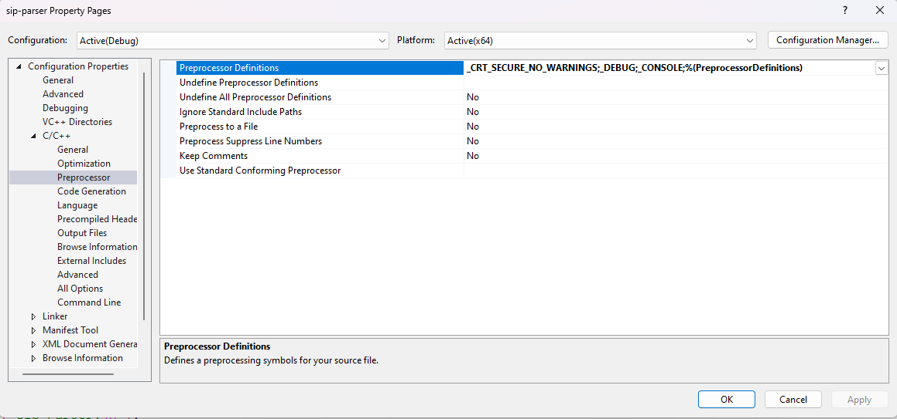

# Microsoft Visual Studio Community 2022

## Shortcuts

### Bookmark

| Action | Shortcut (Default) |
|--------|-------------------|
| Toggle Bookmark | `Ctrl + K`, `Ctrl + K` |
| Next Bookmark | `Ctrl + K`, `Ctrl + N` |
| Previous Bookmark | `Ctrl + K`, `Ctrl + P` |
| Clear All Bookmarks | `Ctrl + K`, `Ctrl + L` |
| Enable/Disable Bookmarks | `Ctrl + K`, `Ctrl + X` |
| Show Bookmark Window | `Ctrl + K`, `Ctrl + W` |

## Build Errors

- [error C4996: 'strncpy'](https://stackoverflow.com/questions/22450423/how-to-use-crt-secure-no-warnings)

